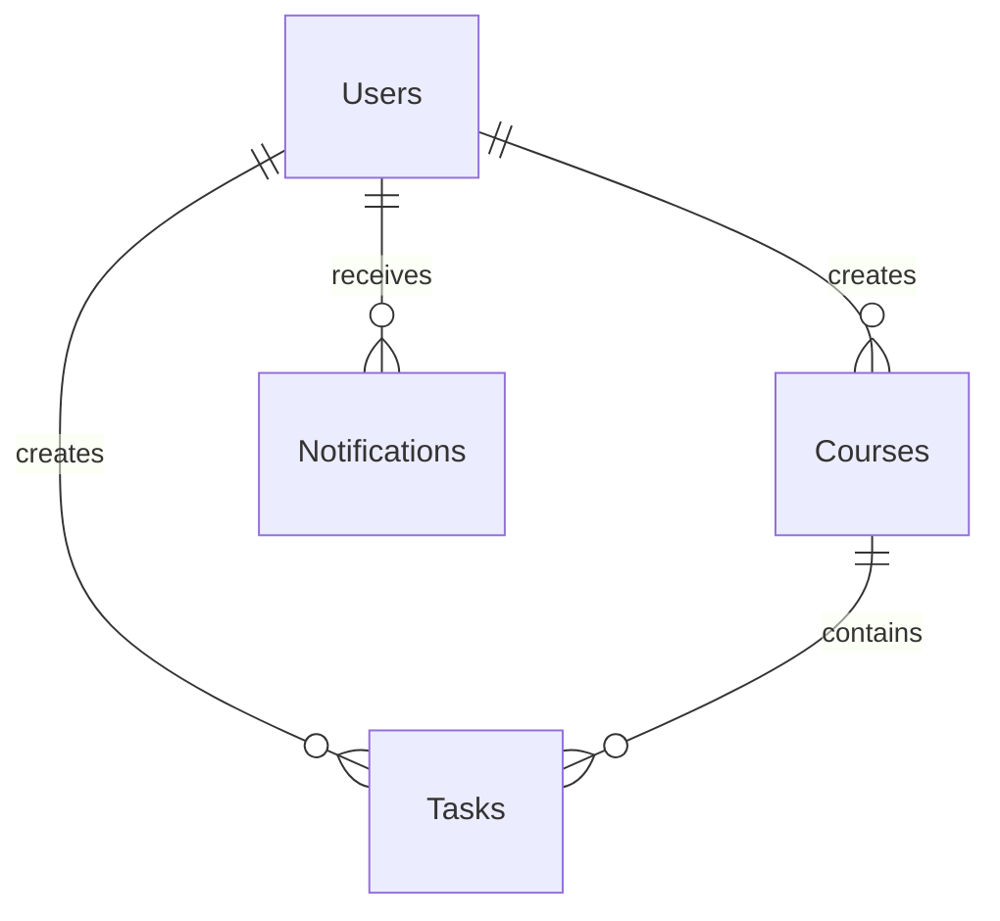

# Study Scheduler - Database Schema Documentation

## Table of Contents
1. [Database Overview](#database-overview)
2. [Table Structures](#table-structures)
3. [Relationships & Constraints](#relationships--constraints)
4. [Indexes & Performance](#indexes--performance)
5. [Sample Data](#sample-data)
6. [Database Operations](#database-operations)
7. [Migration Scripts](#migration-scripts)

## Database Overview

The Study Scheduler application uses **SQLite3** as its primary database, providing a lightweight, serverless database solution that's perfect for development and small to medium-scale deployments.

### Database Features
- **Type**: SQLite3 (file-based)
- **Location**: `backend/database.sqlite`
- **ORM**: Sequelize.js
- **Synchronization**: Auto-sync with `force: true` (development mode)
- **Backup**: File-based, easy to backup and restore

### Database File Information
- **Size**: Varies based on data volume
- **Format**: SQLite3 binary format
- **Access**: Read/Write through Sequelize ORM
- **Concurrency**: Single writer, multiple readers

## Table Structures

### 1. Users Table

The Users table stores all registered user information and serves as the central entity for the application.

```sql
CREATE TABLE Users (
    id INTEGER PRIMARY KEY AUTOINCREMENT,
    email VARCHAR(255) UNIQUE NOT NULL,
    password_hash VARCHAR(255) NOT NULL,
    name VARCHAR(255),
    created_at DATETIME DEFAULT CURRENT_TIMESTAMP,
    updated_at DATETIME DEFAULT CURRENT_TIMESTAMP
);
```

#### Field Descriptions
| Field | Type | Constraints | Description |
|-------|------|-------------|-------------|
| `id` | INTEGER | PRIMARY KEY, AUTOINCREMENT | Unique identifier for each user |
| `email` | VARCHAR(255) | UNIQUE, NOT NULL | User's email address (login credential) |
| `password_hash` | VARCHAR(255) | NOT NULL | Bcrypt-hashed password for security |
| `name` | VARCHAR(255) | NULL | User's display name |
| `created_at` | DATETIME | DEFAULT CURRENT_TIMESTAMP | Account creation timestamp |
| `updated_at` | DATETIME | DEFAULT CURRENT_TIMESTAMP | Last profile update timestamp |

#### Sample Data
```sql
INSERT INTO Users (email, password_hash, name) VALUES
('john.doe@email.com', '$2b$10$hashedpassword123', 'John Doe'),
('jane.smith@email.com', '$2b$10$hashedpassword456', 'Jane Smith'),
('mike.wilson@email.com', '$2b$10$hashedpassword789', 'Mike Wilson');
```

### 2. Courses Table

The Courses table manages academic courses with deadlines and progress tracking.

```sql
CREATE TABLE Courses (
    id INTEGER PRIMARY KEY AUTOINCREMENT,
    name VARCHAR(255) NOT NULL,
    code VARCHAR(255),
    color VARCHAR(50),
    deadline DATETIME,
    user_id INTEGER NOT NULL,
    created_at DATETIME DEFAULT CURRENT_TIMESTAMP,
    updated_at DATETIME DEFAULT CURRENT_TIMESTAMP,
    FOREIGN KEY (user_id) REFERENCES Users(id) ON DELETE CASCADE
);
```

#### Field Descriptions
| Field | Type | Constraints | Description |
|-------|------|-------------|-------------|
| `id` | INTEGER | PRIMARY KEY, AUTOINCREMENT | Unique identifier for each course |
| `name` | VARCHAR(255) | NOT NULL | Course name/title |
| `code` | VARCHAR(255) | NULL | Course code (e.g., CS101, MATH201) |
| `color` | VARCHAR(50) | NULL | Color identifier for UI display |
| `deadline` | DATETIME | NULL | Course completion deadline |
| `user_id` | INTEGER | NOT NULL, FOREIGN KEY | Reference to the user who owns this course |
| `created_at` | DATETIME | DEFAULT CURRENT_TIMESTAMP | Course creation timestamp |
| `updated_at` | DATETIME | DEFAULT CURRENT_TIMESTAMP | Last course update timestamp |

#### Sample Data
```sql
INSERT INTO Courses (name, code, color, deadline, user_id) VALUES
('Introduction to Computer Science', 'CS101', 'blue', '2024-12-31 23:59:59', 1),
('Advanced Mathematics', 'MATH201', 'green', '2024-11-30 23:59:59', 1),
('Web Development Fundamentals', 'WEB101', 'purple', '2024-10-31 23:59:59', 2);
```

### 3. Tasks Table

The Tasks table manages individual tasks and assignments with priorities and completion status.

```sql
CREATE TABLE Tasks (
    id INTEGER PRIMARY KEY AUTOINCREMENT,
    title VARCHAR(255) NOT NULL,
    due_date DATETIME NOT NULL,
    priority ENUM('HIGH', 'MEDIUM', 'LOW') DEFAULT 'MEDIUM',
    completed BOOLEAN DEFAULT FALSE,
    user_id INTEGER NOT NULL,
    course_id INTEGER,
    created_at DATETIME DEFAULT CURRENT_TIMESTAMP,
    updated_at DATETIME DEFAULT CURRENT_TIMESTAMP,
    FOREIGN KEY (user_id) REFERENCES Users(id) ON DELETE CASCADE,
    FOREIGN KEY (course_id) REFERENCES Courses(id) ON DELETE SET NULL
);
```

#### Field Descriptions
| Field | Type | Constraints | Description |
|-------|------|-------------|-------------|
| `id` | INTEGER | PRIMARY KEY, AUTOINCREMENT | Unique identifier for each task |
| `title` | VARCHAR(255) | NOT NULL | Task title/description |
| `due_date` | DATETIME | NOT NULL | Task completion deadline |
| `priority` | ENUM | DEFAULT 'MEDIUM' | Priority level (HIGH, MEDIUM, LOW) |
| `completed` | BOOLEAN | DEFAULT FALSE | Task completion status |
| `user_id` | INTEGER | NOT NULL, FOREIGN KEY | Reference to the user who owns this task |
| `course_id` | INTEGER | NULL, FOREIGN KEY | Reference to the associated course (optional) |
| `created_at` | DATETIME | DEFAULT CURRENT_TIMESTAMP | Task creation timestamp |
| `updated_at` | DATETIME | DEFAULT CURRENT_TIMESTAMP | Last task update timestamp |

#### Sample Data
```sql
INSERT INTO Tasks (title, due_date, priority, completed, user_id, course_id) VALUES
('Complete Assignment 1', '2024-12-15 23:59:59', 'HIGH', FALSE, 1, 1),
('Read Chapter 5', '2024-12-10 23:59:59', 'MEDIUM', FALSE, 1, 1),
('Submit Final Project', '2024-12-20 23:59:59', 'HIGH', FALSE, 1, 2),
('Review Course Material', '2024-12-05 23:59:59', 'LOW', TRUE, 2, 3);
```

### 4. Notifications Table

The Notifications table manages in-app and email notifications for users.

```sql
CREATE TABLE Notifications (
    id INTEGER PRIMARY KEY AUTOINCREMENT,
    title VARCHAR(255) NOT NULL,
    message TEXT NOT NULL,
    type ENUM('TASK_DUE', 'TASK_OVERDUE', 'COURSE_REMINDER', 'SYSTEM', 'ACHIEVEMENT') DEFAULT 'SYSTEM',
    is_read BOOLEAN DEFAULT FALSE,
    priority ENUM('LOW', 'MEDIUM', 'HIGH', 'URGENT') DEFAULT 'MEDIUM',
    action_url VARCHAR(255),
    scheduled_for DATETIME,
    user_id INTEGER NOT NULL,
    created_at DATETIME DEFAULT CURRENT_TIMESTAMP,
    updated_at DATETIME DEFAULT CURRENT_TIMESTAMP,
    FOREIGN KEY (user_id) REFERENCES Users(id) ON DELETE CASCADE
);
```

#### Field Descriptions
| Field | Type | Constraints | Description |
|-------|------|-------------|-------------|
| `id` | INTEGER | PRIMARY KEY, AUTOINCREMENT | Unique identifier for each notification |
| `title` | VARCHAR(255) | NOT NULL | Notification title |
| `message` | TEXT | NOT NULL | Detailed notification message |
| `type` | ENUM | DEFAULT 'SYSTEM' | Type of notification |
| `is_read` | BOOLEAN | DEFAULT FALSE | Read status indicator |
| `priority` | ENUM | DEFAULT 'MEDIUM' | Notification priority level |
| `action_url` | VARCHAR(255) | NULL | URL for notification action |
| `scheduled_for` | DATETIME | NULL | Scheduled notification time |
| `user_id` | INTEGER | NOT NULL, FOREIGN KEY | Reference to the user receiving the notification |
| `created_at` | DATETIME | DEFAULT CURRENT_TIMESTAMP | Notification creation timestamp |
| `updated_at` | DATETIME | DEFAULT CURRENT_TIMESTAMP | Last notification update timestamp |

#### Sample Data
```sql
INSERT INTO Notifications (title, message, type, priority, user_id) VALUES
('Task Due Soon', 'Assignment 1 is due in 24 hours', 'TASK_DUE', 'HIGH', 1),
('Course Reminder', 'Web Development course deadline approaching', 'COURSE_REMINDER', 'MEDIUM', 2),
('Welcome!', 'Welcome to Study Scheduler!', 'SYSTEM', 'LOW', 1);
```

## Relationships & Constraints

### Foreign Key Relationships



#### Relationship Details

1. **Users → Courses (1:N)**
   - One user can have multiple courses
   - Each course belongs to exactly one user
   - **Constraint**: `ON DELETE CASCADE` - Deleting a user removes all their courses

2. **Users → Tasks (1:N)**
   - One user can have multiple tasks
   - Each task belongs to exactly one user
   - **Constraint**: `ON DELETE CASCADE` - Deleting a user removes all their tasks

3. **Users → Notifications (1:N)**
   - One user can receive multiple notifications
   - Each notification belongs to exactly one user
   - **Constraint**: `ON DELETE CASCADE` - Deleting a user removes all their notifications

4. **Courses → Tasks (1:N)**
   - One course can have multiple tasks
   - Each task can optionally belong to a course
   - **Constraint**: `ON DELETE SET NULL` - Deleting a course sets course_id to NULL in tasks

### Data Integrity Constraints

#### Unique Constraints
- **Users.email**: Must be unique across all users
- **Composite constraints**: None currently implemented

#### Check Constraints
- **Tasks.priority**: Must be one of: 'HIGH', 'MEDIUM', 'LOW'
- **Tasks.completed**: Must be TRUE or FALSE
- **Notifications.type**: Must be one of: 'TASK_DUE', 'TASK_OVERDUE', 'COURSE_REMINDER', 'SYSTEM', 'ACHIEVEMENT'
- **Notifications.priority**: Must be one of: 'LOW', 'MEDIUM', 'HIGH', 'URGENT'

#### Not Null Constraints
- **Users**: email, password_hash
- **Courses**: name, user_id
- **Tasks**: title, due_date, user_id
- **Notifications**: title, message, user_id

## Indexes & Performance

### Primary Indexes
- **Users.id**: Primary key, auto-indexed
- **Courses.id**: Primary key, auto-indexed
- **Tasks.id**: Primary key, auto-indexed
- **Notifications.id**: Primary key, auto-indexed

### Recommended Indexes
```sql
-- Performance optimization indexes
CREATE INDEX idx_users_email ON Users(email);
CREATE INDEX idx_courses_user_id ON Courses(user_id);
CREATE INDEX idx_tasks_user_id ON Tasks(user_id);
CREATE INDEX idx_tasks_course_id ON Tasks(course_id);
CREATE INDEX idx_tasks_due_date ON Tasks(due_date);
CREATE INDEX idx_tasks_completed ON Tasks(completed);
CREATE INDEX idx_notifications_user_id ON Notifications(user_id);
CREATE INDEX idx_notifications_is_read ON Notifications(is_read);
CREATE INDEX idx_notifications_scheduled_for ON Notifications(scheduled_for);
```

### Query Optimization
- **User-specific queries**: Use `user_id` index for filtering
- **Task filtering**: Use `due_date` and `completed` indexes
- **Notification queries**: Use `user_id` and `is_read` indexes

## Sample Data

### Complete Sample Dataset

```sql
-- Insert sample users
INSERT INTO Users (email, password_hash, name) VALUES
('student1@university.edu', '$2b$10$hashedpassword123', 'Alice Johnson'),
('student2@university.edu', '$2b$10$hashedpassword456', 'Bob Smith'),
('student3@university.edu', '$2b$10$hashedpassword789', 'Carol Davis');

-- Insert sample courses
INSERT INTO Courses (name, code, color, deadline, user_id) VALUES
('Computer Science Fundamentals', 'CS101', 'blue', '2024-12-31 23:59:59', 1),
('Advanced Mathematics', 'MATH201', 'green', '2024-11-30 23:59:59', 1),
('Web Development', 'WEB101', 'purple', '2024-10-31 23:59:59', 2),
('Data Structures', 'CS201', 'red', '2024-12-15 23:59:59', 3);

-- Insert sample tasks
INSERT INTO Tasks (title, due_date, priority, completed, user_id, course_id) VALUES
('Complete Assignment 1', '2024-12-15 23:59:59', 'HIGH', FALSE, 1, 1),
('Read Chapter 5', '2024-12-10 23:59:59', 'MEDIUM', FALSE, 1, 1),
('Submit Final Project', '2024-12-20 23:59:59', 'HIGH', FALSE, 1, 2),
('Review Course Material', '2024-12-05 23:59:59', 'LOW', TRUE, 2, 3),
('Practice Problems', '2024-12-12 23:59:59', 'MEDIUM', FALSE, 2, 3),
('Algorithm Implementation', '2024-12-18 23:59:59', 'HIGH', FALSE, 3, 4);

-- Insert sample notifications
INSERT INTO Notifications (title, message, type, priority, user_id) VALUES
('Task Due Soon', 'Assignment 1 is due in 24 hours', 'TASK_DUE', 'HIGH', 1),
('Course Reminder', 'Web Development course deadline approaching', 'COURSE_REMINDER', 'MEDIUM', 2),
('Welcome!', 'Welcome to Study Scheduler!', 'SYSTEM', 'LOW', 1),
('Achievement Unlocked', 'Completed your first task!', 'ACHIEVEMENT', 'LOW', 2);
```

## Database Operations

### Common Queries

#### User Management
```sql
-- Get user by email
SELECT * FROM Users WHERE email = 'student1@university.edu';

-- Get user with courses
SELECT u.*, COUNT(c.id) as course_count 
FROM Users u 
LEFT JOIN Courses c ON u.id = c.user_id 
WHERE u.id = 1 
GROUP BY u.id;
```

#### Task Management
```sql
-- Get user's incomplete tasks
SELECT t.*, c.name as course_name 
FROM Tasks t 
LEFT JOIN Courses c ON t.course_id = c.id 
WHERE t.user_id = 1 AND t.completed = FALSE 
ORDER BY t.due_date ASC;

-- Get overdue tasks
SELECT t.*, c.name as course_name 
FROM Tasks t 
LEFT JOIN Courses c ON t.course_id = c.id 
WHERE t.user_id = 1 AND t.due_date < datetime('now') AND t.completed = FALSE;
```

#### Course Progress
```sql
-- Get course progress statistics
SELECT 
    c.name,
    c.deadline,
    COUNT(t.id) as total_tasks,
    SUM(CASE WHEN t.completed THEN 1 ELSE 0 END) as completed_tasks,
    ROUND(
        (SUM(CASE WHEN t.completed THEN 1 ELSE 0 END) * 100.0) / COUNT(t.id), 2
    ) as completion_percentage
FROM Courses c 
LEFT JOIN Tasks t ON c.id = t.course_id 
WHERE c.user_id = 1 
GROUP BY c.id;
```

### Data Maintenance

#### Cleanup Operations
```sql
-- Remove old completed tasks (older than 30 days)
DELETE FROM Tasks 
WHERE completed = TRUE 
AND updated_at < datetime('now', '-30 days');

-- Remove old notifications (older than 90 days)
DELETE FROM Notifications 
WHERE created_at < datetime('now', '-90 days');

-- Mark old notifications as read
UPDATE Notifications 
SET is_read = TRUE 
WHERE created_at < datetime('now', '-7 days') 
AND is_read = FALSE;
```

## Migration Scripts

### Database Initialization
```sql
-- Create tables with proper constraints
PRAGMA foreign_keys = ON;

-- Users table
CREATE TABLE IF NOT EXISTS Users (
    id INTEGER PRIMARY KEY AUTOINCREMENT,
    email VARCHAR(255) UNIQUE NOT NULL,
    password_hash VARCHAR(255) NOT NULL,
    name VARCHAR(255),
    created_at DATETIME DEFAULT CURRENT_TIMESTAMP,
    updated_at DATETIME DEFAULT CURRENT_TIMESTAMP
);

-- Courses table
CREATE TABLE IF NOT EXISTS Courses (
    id INTEGER PRIMARY KEY AUTOINCREMENT,
    name VARCHAR(255) NOT NULL,
    code VARCHAR(255),
    color VARCHAR(50),
    deadline DATETIME,
    user_id INTEGER NOT NULL,
    created_at DATETIME DEFAULT CURRENT_TIMESTAMP,
    updated_at DATETIME DEFAULT CURRENT_TIMESTAMP,
    FOREIGN KEY (user_id) REFERENCES Users(id) ON DELETE CASCADE
);

-- Tasks table
CREATE TABLE IF NOT EXISTS Tasks (
    id INTEGER PRIMARY KEY AUTOINCREMENT,
    title VARCHAR(255) NOT NULL,
    due_date DATETIME NOT NULL,
    priority VARCHAR(10) DEFAULT 'MEDIUM' CHECK (priority IN ('HIGH', 'MEDIUM', 'LOW')),
    completed BOOLEAN DEFAULT FALSE,
    user_id INTEGER NOT NULL,
    course_id INTEGER,
    created_at DATETIME DEFAULT CURRENT_TIMESTAMP,
    updated_at DATETIME DEFAULT CURRENT_TIMESTAMP,
    FOREIGN KEY (user_id) REFERENCES Users(id) ON DELETE CASCADE,
    FOREIGN KEY (course_id) REFERENCES Courses(id) ON DELETE SET NULL
);

-- Notifications table
CREATE TABLE IF NOT EXISTS Notifications (
    id INTEGER PRIMARY KEY AUTOINCREMENT,
    title VARCHAR(255) NOT NULL,
    message TEXT NOT NULL,
    type VARCHAR(20) DEFAULT 'SYSTEM' CHECK (type IN ('TASK_DUE', 'TASK_OVERDUE', 'COURSE_REMINDER', 'SYSTEM', 'ACHIEVEMENT')),
    is_read BOOLEAN DEFAULT FALSE,
    priority VARCHAR(10) DEFAULT 'MEDIUM' CHECK (priority IN ('LOW', 'MEDIUM', 'HIGH', 'URGENT')),
    action_url VARCHAR(255),
    scheduled_for DATETIME,
    user_id INTEGER NOT NULL,
    created_at DATETIME DEFAULT CURRENT_TIMESTAMP,
    updated_at DATETIME DEFAULT CURRENT_TIMESTAMP,
    FOREIGN KEY (user_id) REFERENCES Users(id) ON DELETE CASCADE
);

-- Create indexes for performance
CREATE INDEX IF NOT EXISTS idx_users_email ON Users(email);
CREATE INDEX IF NOT EXISTS idx_courses_user_id ON Courses(user_id);
CREATE INDEX IF NOT EXISTS idx_tasks_user_id ON Tasks(user_id);
CREATE INDEX IF NOT EXISTS idx_tasks_course_id ON Tasks(course_id);
CREATE INDEX IF NOT EXISTS idx_tasks_due_date ON Tasks(due_date);
CREATE INDEX IF NOT EXISTS idx_tasks_completed ON Tasks(completed);
CREATE INDEX IF NOT EXISTS idx_notifications_user_id ON Notifications(user_id);
CREATE INDEX IF NOT EXISTS idx_notifications_is_read ON Notifications(is_read);
CREATE INDEX IF NOT EXISTS idx_notifications_scheduled_for ON Notifications(scheduled_for);
```

---

**Note**: This schema is designed for SQLite3 and includes all necessary constraints, indexes, and sample data for the Study Scheduler application. The database supports the full application functionality while maintaining data integrity and performance.
