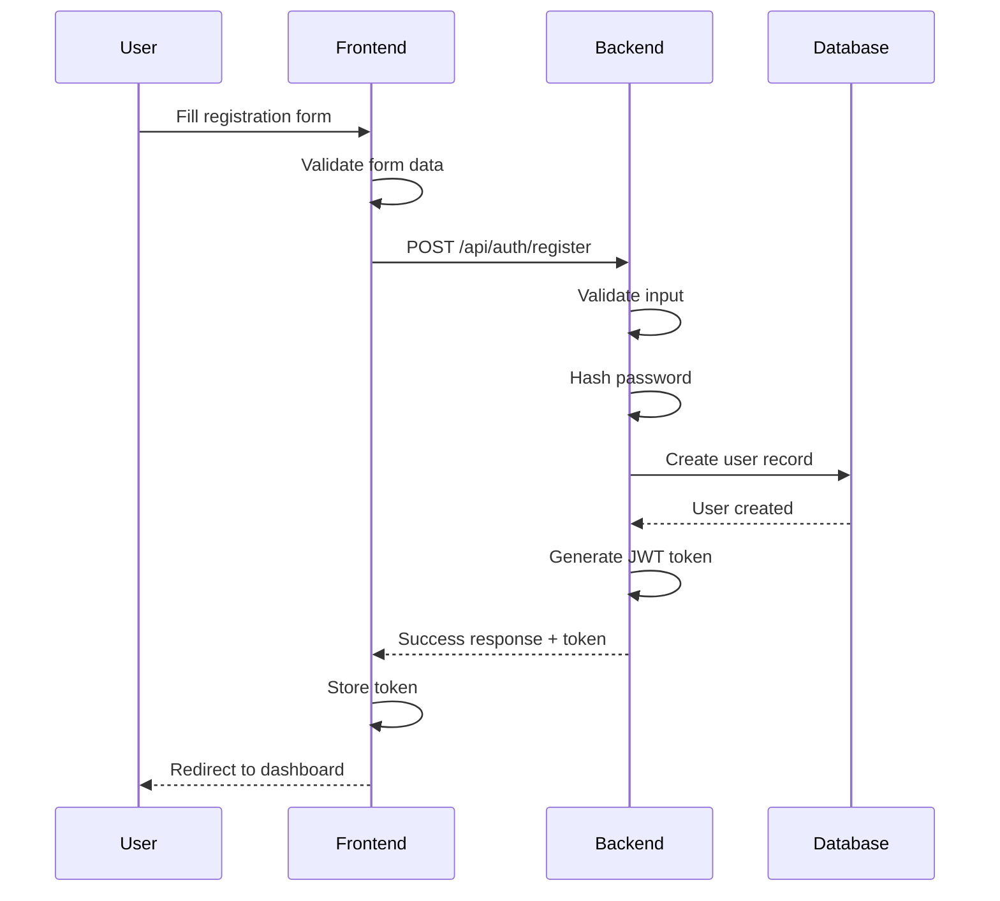
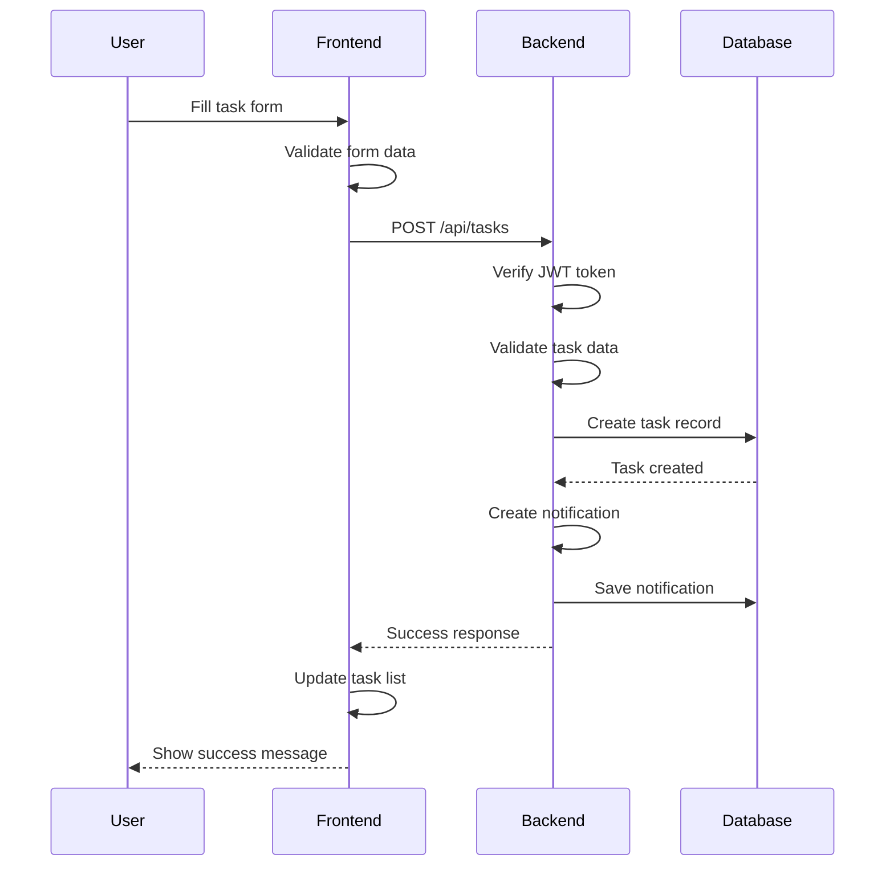
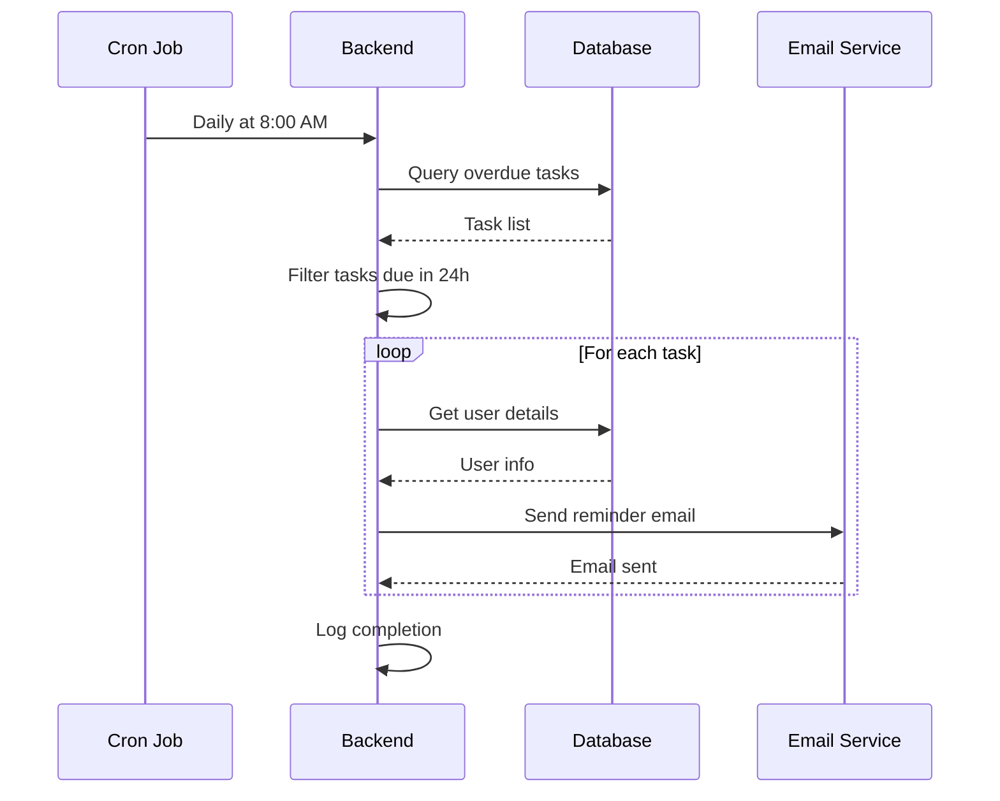
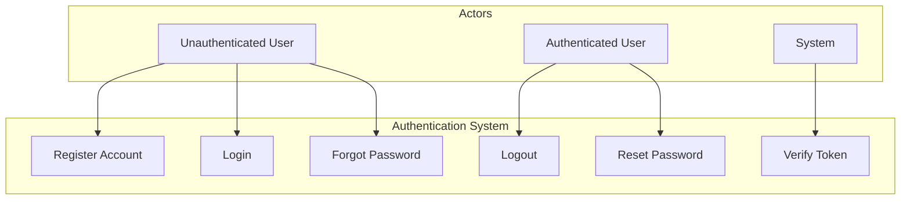
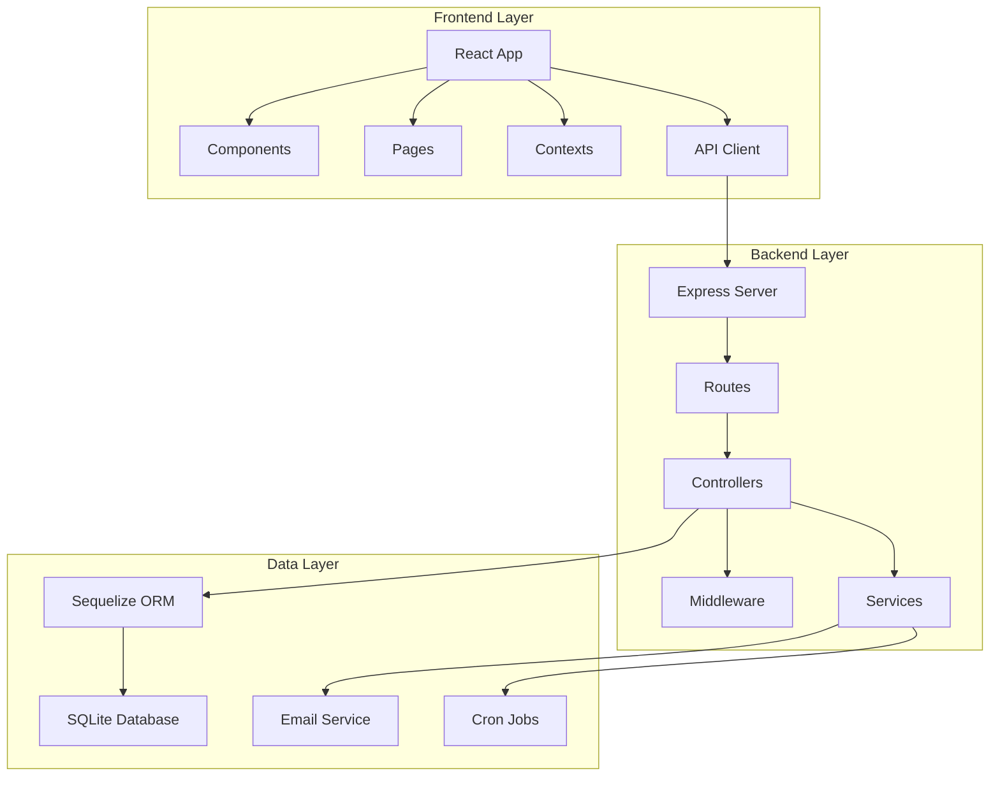
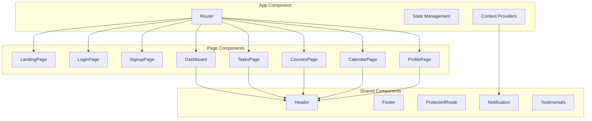
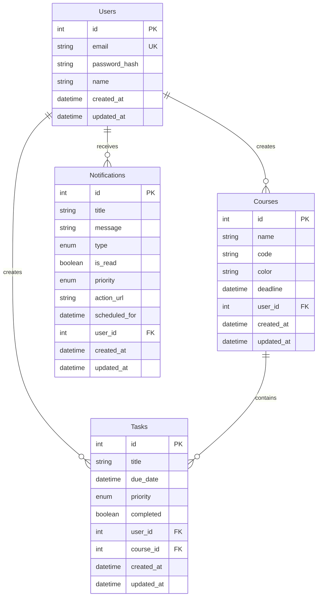
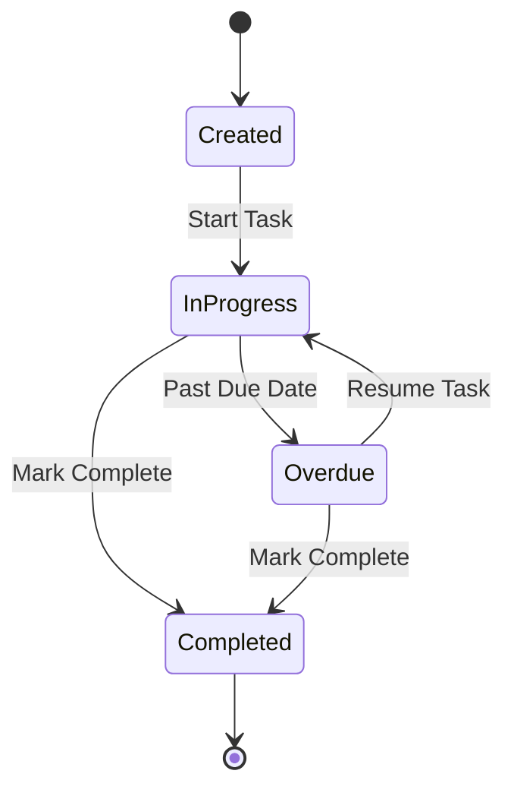
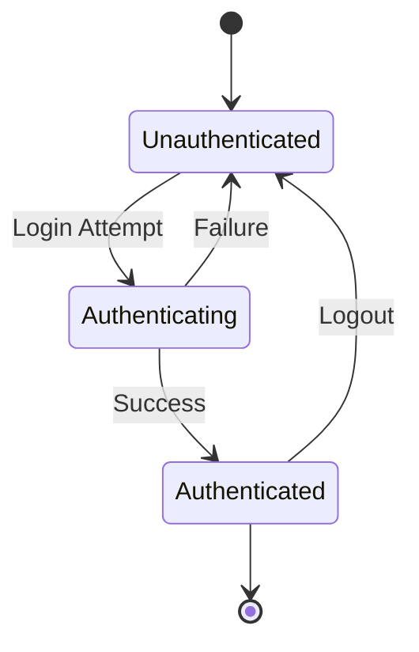

# Study Scheduler - UML Diagrams & System Design

## Table of Contents
1. [Class Diagrams](#class-diagrams)
2. [Sequence Diagrams](#sequence-diagrams)
3. [Use Case Diagrams](#use-case-diagrams)
4. [Component Diagrams](#component-diagrams)
5. [Database ERD](#database-erd)

## Class Diagrams

### 1. Backend Models Class Diagram

```mermaid
classDiagram
    class User {
        +Integer id
        +String email
        +String password_hash
        +String name
        +DateTime created_at
        +DateTime updated_at
        +createUser()
        +findByEmail()
        +validatePassword()
    }
    
    class Course {
        +Integer id
        +String name
        +String code
        +String color
        +DateTime deadline
        +Integer user_id
        +DateTime created_at
        +DateTime updated_at
        +createCourse()
        +updateCourse()
        +deleteCourse()
    }
    
    class Task {
        +Integer id
        +String title
        +DateTime due_date
        +String priority
        +Boolean completed
        +Integer user_id
        +Integer course_id
        +DateTime created_at
        +DateTime updated_at
        +createTask()
        +updateTask()
        +toggleCompletion()
        +getOverdueTasks()
    }
    
    class Notification {
        +Integer id
        +String title
        +String message
        +String type
        +Boolean is_read
        +String priority
        +String action_url
        +DateTime scheduled_for
        +Integer user_id
        +DateTime created_at
        +DateTime updated_at
        +createNotification()
        +markAsRead()
        +sendEmail()
    }
    
    class Sequelize {
        +authenticate()
        +sync()
        +close()
    }
    
    User ||--o{ Course : "has many"
    User ||--o{ Task : "has many"
    User ||--o{ Notification : "has many"
    Course ||--o{ Task : "has many"
    User }o--|| Sequelize : "uses"
```

### 2. Frontend Components Class Diagram

```mermaid
classDiagram
    class App {
        +User user
        +String token
        +Boolean initializing
        +useEffect()
        +render()
    }
    
    class Dashboard {
        +Array tasks
        +Array courses
        +Function addNotification
        +useEffect()
        +computeCourseProgress()
        +render()
    }
    
    class TasksPage {
        +Array tasks
        +Array courses
        +String filter
        +String sortBy
        +createTask()
        +updateTask()
        +deleteTask()
        +toggleTask()
        +render()
    }
    
    class CoursesPage {
        +Array courses
        +Boolean showForm
        +Object formData
        +createCourse()
        +updateCourse()
        +deleteCourse()
        +render()
    }
    
    class Header {
        +User user
        +Function setUser
        +logout()
        +render()
    }
    
    class NotificationContext {
        +Array notifications
        +Function addNotification
        +Function removeNotification
        +Function markAsRead
        +Provider value
    }
    
    App ||--|| Dashboard : "renders"
    App ||--|| TasksPage : "renders"
    App ||--|| CoursesPage : "renders"
    App ||--|| Header : "renders"
    App ||--|| NotificationContext : "provides"
    Dashboard ||--|| NotificationContext : "uses"
```

### 3. Controllers Class Diagram

```mermaid
classDiagram
    class AuthController {
        +register(req, res)
        +login(req, res)
        +me(req, res)
        +validateInput()
        +hashPassword()
        +generateToken()
    }
    
    class CourseController {
        +getCourses(req, res)
        +createCourse(req, res)
        +updateCourse(req, res)
        +deleteCourse(req, res)
        +validateCourse()
        +checkOwnership()
    }
    
    class TaskController {
        +getTasks(req, res)
        +createTask(req, res)
        +updateTask(req, res)
        +deleteTask(req, res)
        +toggleTask(req, res)
        +getOverdueTasks(req, res)
        +validateTask()
        +checkOwnership()
    }
    
    class AuthMiddleware {
        +verifyToken(req, res, next)
        +extractToken()
        +validateToken()
    }
    
    AuthController ||--|| AuthMiddleware : "uses"
    CourseController ||--|| AuthMiddleware : "uses"
    TaskController ||--|| AuthMiddleware : "uses"
```

## Sequence Diagrams

### 1. User Registration Flow



### 2. Task Creation Flow



### 3. Daily Task Reminder Flow



## Use Case Diagrams

### 1. Main System Use Cases

```mermaid
graph TB
    subgraph "Study Scheduler System"
        subgraph "User Management"
            UC1[Register Account]
            UC2[Login]
            UC3[View Profile]
            UC4[Update Profile]
        end
        
        subgraph "Course Management"
            UC5[Create Course]
            UC6[Edit Course]
            UC7[Delete Course]
            UC8[View Course Progress]
        end
        
        subgraph "Task Management"
            UC9[Create Task]
            UC10[Edit Task]
            UC11[Delete Task]
            UC12[Mark Task Complete]
            UC13[Set Task Priority]
        end
        
        subgraph "Notifications"
            UC14[View Notifications]
            UC15[Mark Notification Read]
            UC16[Receive Email Reminders]
        end
        
        subgraph "Dashboard"
            UC17[View Dashboard]
            UC18[View Statistics]
            UC19[Quick Actions]
        end
    end
    
    subgraph "Actors"
        A1[Student]
        A2[Teacher]
        A3[System]
    end
    
    A1 --> UC1
    A1 --> UC2
    A1 --> UC5
    A1 --> UC6
    A1 --> UC7
    A1 --> UC8
    A1 --> UC9
    A1 --> UC10
    A1 --> UC11
    A1 --> UC12
    A1 --> UC13
    A1 --> UC14
    A1 --> UC15
    A1 --> UC17
    A1 --> UC18
    A1 --> UC19
    
    A2 --> UC1
    A2 --> UC2
    A2 --> UC5
    A2 --> UC6
    A2 --> UC7
    A2 --> UC8
    A2 --> UC9
    A2 --> UC10
    A2 --> UC11
    A2 --> UC12
    A2 --> UC13
    A2 --> UC14
    A2 --> UC15
    A2 --> UC17
    A2 --> UC18
    A2 --> UC19
    
    A3 --> UC16
```



### 2. Authentication Use Cases



## Component Diagrams

### 1. System Architecture Components



### 2. Frontend Component Structure



## Database ERD

### Complete Entity Relationship Diagram



## State Machine Diagrams

### 1. Task State Machine



### 2. User Authentication State



---

**Note**: These diagrams are generated using Mermaid syntax and can be rendered in GitHub, GitLab, or any Mermaid-compatible viewer. The diagrams provide a comprehensive view of the system architecture, data flow, and component relationships.
